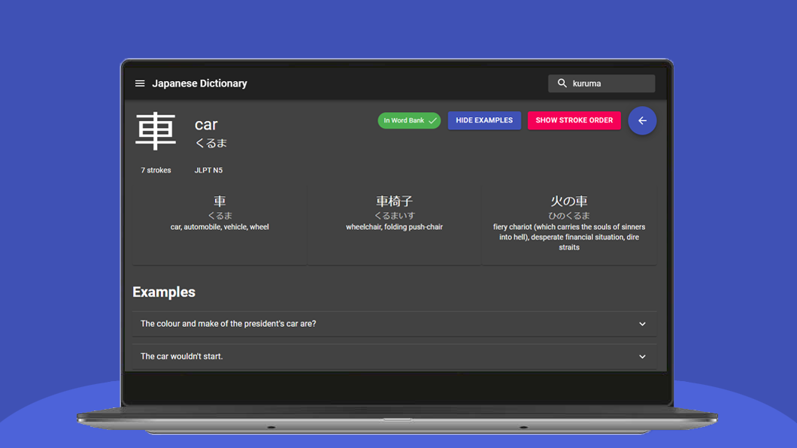
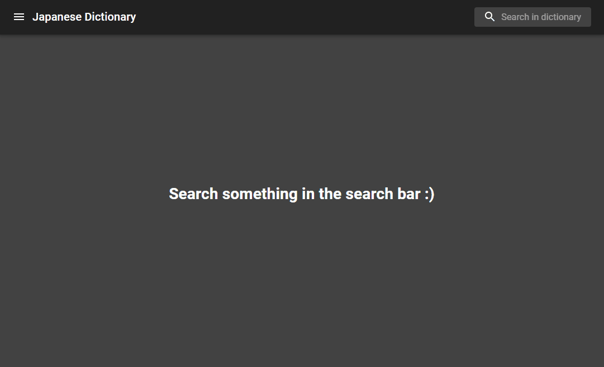
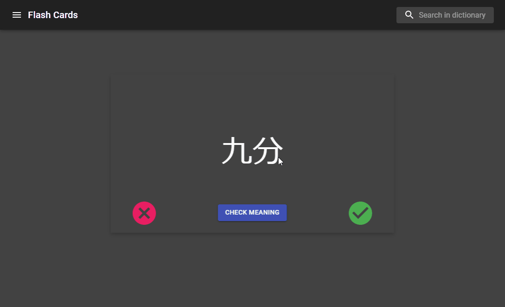
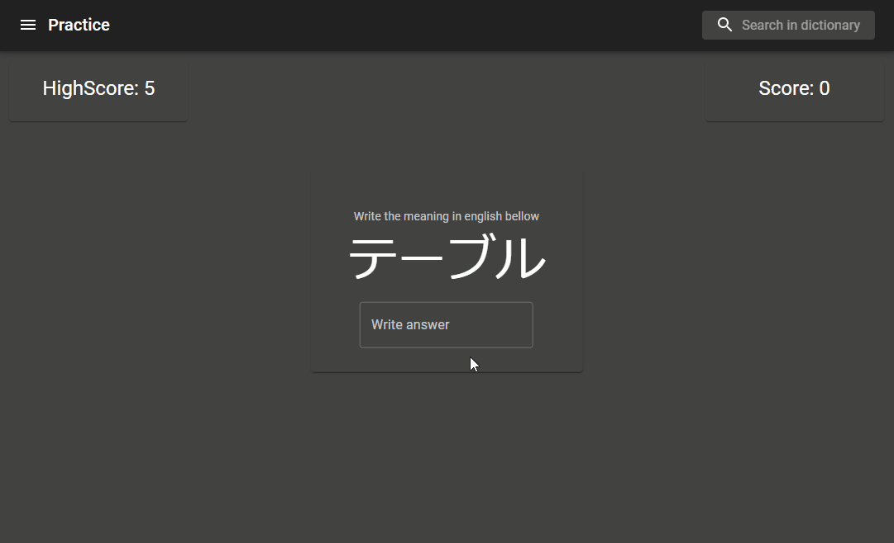
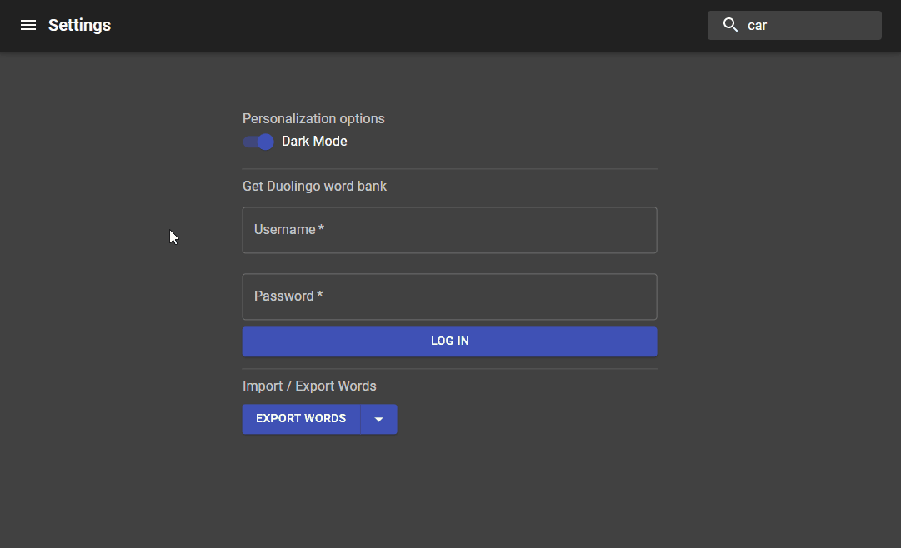
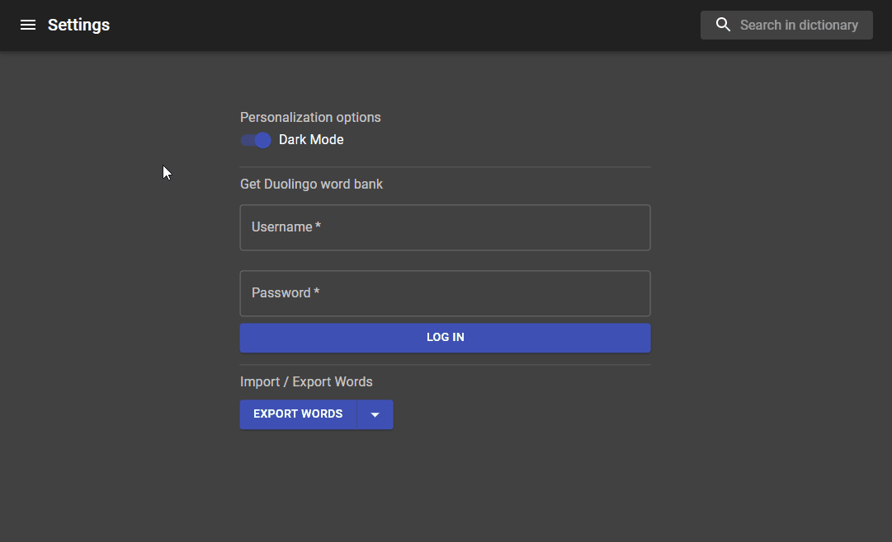

<h1> Japanese Dictionary</h1>

I am currently learning japanese on my own, and I wanted to print out some flashcards to train kanji, but instead of wasting paper, I thought why not make an app for that? So I achieve this using React and Electron.

## Index

* [Requirements](#requirements)
* [Installation](#installation)
* [Features](#features)
    * [Dictionary](#dictionary)
    * [Word Bank](#word-bank)
    * [Flash Cards](#flash-cards)
    * [Practice](#practice)
    * [Duolingo Login](#duolingo-login)
    * [Dark Mode](#dark-mode)
    * [Import/Export Data](#importexport-data)
* [Incoming Features](#incoming-features)

## Requirements

If you just want to use the app, you only need a Windows PC, you can download the latest release of the app [here](https://github.com/galmeida9/japanese_dictionary/releases).

If you want to install the project you need [npm](https://www.npmjs.com/).

## Installation

There is no installation for the releases, you just need to open the ``Japanese Dictionary.exe``.

For the project, you just need to run ``npm install`` and then ``npm run dev``. To build the app you just need to run ``npm run ebuild`` (this can throw an error saying that it could not set the icon for the executable file, but other from that the app builds well).

## Features

### Dictionary

Searches in **english**, **hiragana**, **katakana**, **kanji** and **romanji** in the Jisho.org dictionary. In each word it is possible to view some examples, stroke order for kanjis, and the option to add it to your word bank.

### Word Bank

Stores all your added words, giving you the ability to search them, consult them, check their definition and delete them.

### Flash Cards

Words from your word bank are randomly selected and you need to indicate if you know the word or not, the card can be flipped to show the reading of the word and its meaning. If you do not know a word, it gets asked again in the future until you know it. It is a fast and effective you of memorizing and remembering all your learned words.

The flash cards also have shortcuts to speed up your learning:

* **Right Arrow** indicates that you know the word
* **Left Arrow** indicates that you do not know the word
* **Space** Flips the card

### Practice

Words from the word bank are randomly chosen and if they are in kanji you have to write them, otherwise you have to type their meaning in english.

### Duolingo Login

Login into your duolingo account to import all the words you have learned so far into your word bank.

### Dark Mode

Dark mode is supported and your preference is saved, so the next time you use the app your eyes can be relaxed.

### Import/Export Data

You can save all your data by exporting it to a location of your preference and if you update the app, or for some reason you lost all your data, you can just import your data again.

## Incoming Features

* Study Material (hiragana and katakana charts and other materials)